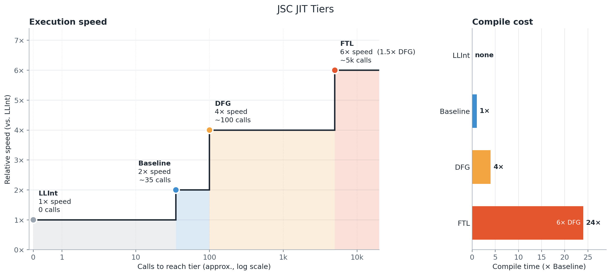
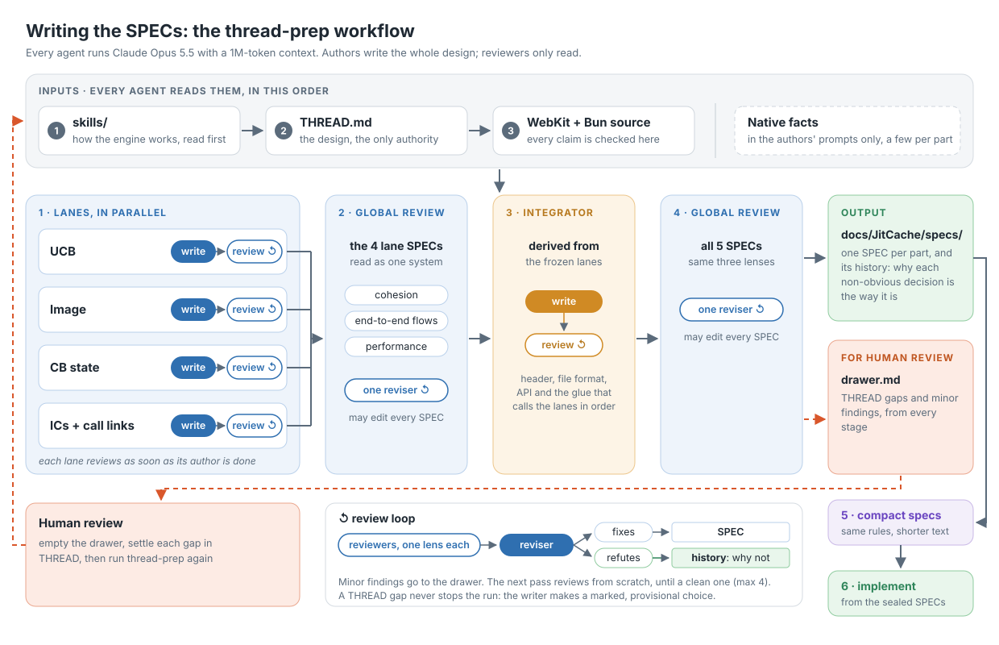

# JITCache

JITCache lets bun save jit code and all its related state to disk resulting in ~2x faster runs for a small cost in the beginning of each function.

## Getting started

### Bun

JITCache ships as a Bun (1.4.2 :) build for Linux, x86_64 and ARM64:

```sh
curl -fsSLO https://github.com/Davi-ldc/bun/releases/download/bun-v1.4.2-jitcache-v1/bun-linux-x64.zip
unzip bun-linux-x64.zip && export PATH="$PWD/bun-linux-x64:$PATH"
```

Then run:

```sh
bun --jitcache=./.jitcache --jitcache-mode=p run server.ts
```

`p` creates the cache and saves each function's JIT code as it is compiled. Then, to use the cached code (each function is checked against its source, so one you edited compiles as usual), run:

```sh
bun --jitcache=./.jitcache run server.ts
```

`c`, the default, only reads the cache. `p-c` reads and writes: it runs from the saved functions and keeps updating them when it learns more[^1], which is how a server keeps improving a cache, since `p` only creates new ones. Every write is atomic, so any number of processes can read a cache while one writes to it; a `p-c` that finds another process writing runs as `c`. You can ship the cache directory with your deployment, as long as it was produced by the same Bun binary on machines with the same CPU features: a cache from anything else is ignored, and the process runs as if JITCache were off.

| Flag | Values |
|---|---|
| `--jitcache=<dir>` | the cache's directory; JITCache is off without it |
| `--jitcache-mode=<mode>` | `c` (default), `p` or `p-c` |
| `--jitcache-max-memory=<bytes>` | the memory `p` and `p-c` may spend on recording, in bytes (with a `K`, `M` or `G` suffix) or `unlimited`, the default |
| `--jitcache-strict` | validates everything the cache holds and every assumption JITCache makes; slower, and off by default |
| `--jitcache-log` | prints JITCache's status to stderr at start and at exit |

Two commands maintain a cache:

```sh
bun jitcache clean ./.jitcache          # remove the files of writes that never finished
bun jitcache compact ./.jitcache 0.25   # evict the quarter of the bytes that saves the least warm-up
```

### Other hosts

A program that embeds JavaScriptCore drives JITCache through `JavaScriptCore/JITCacheAPI.h`. It configures each VM right after creating it, before the VM's first global object, while holding the VM's API lock:

```cpp
#include <JavaScriptCore/JITCacheAPI.h>

JSC::JSLockHolder lock(vm);
JSC::JITCache::Config config;
config.artifactPath = "/var/cache/my-app"_s;
config.role = JSC::JITCache::Role::Producer;
auto started = JSC::JITCache::start(vm, config); // Created, Opened, Busy, Rejected or Fault
```

On `Busy`, another process is producing, and the host can call `start` again as a `Consumer`. `status(vm)` reports the session's state, progress and faults without doing any work. JITCache never saves on its own at exit, so a producing host chooses when to call `delta(vm)`, which saves what each function learned since its compile, usually when the instance is idle or about to stop; it calls it holding the API lock and no JSC-internal lock. The API returns results and never calls back, and `toJSON` turns any result into a log line. `JavaScriptCore/JITCacheMaintenance.h` declares `clean` and `compact`. The jsc shell takes the same flags as Bun, plus `--jitcache-delta-at-exit`.

## Why

JavaScript engines like JavaScriptCore and V8 have some of the best compiler tech in the world. To get close to high-performance statically typed languages like C, the engine records information about the types (and internal structures) while interpreting your code, and after a certain threshold it compiles progressively more optimized code (divided in 4 tiers), speculating that the types will stay stable.



[This post](https://webkit.org/blog/10308/speculation-in-javascriptcore/) from [@filpizlo](https://x.com/filpizlo) explains it :)

The mechanism is incredible, but it was designed to serve the browser with ephemeral tabs and state-dependent code. Even though, today, [two-thirds of developers use JavaScript](https://survey.stackoverflow.co/2025/technology) and [it powers a third of every lambda function](https://www.datadoghq.com/state-of-serverless-2021/). Every instance has to climb the optimisation mountain from scratch, and all the knowledge it collects is thrown away when it dies, or ignored when other workers start. JITCache solves that.


## How 

### it was made

Claude doesn't know much about WebKit's internals, and a lot of what it assumes is wrong. So I took a month to study JSC and its JIT and documented everything in Portuguese (skills/reference/pt/), then cut the parts only a human needs, translated the rest to English (skills/reference/) and gave each doc its own agent to drain the reports other agents file against it, always keeping each one under 40,000 bytes. Then, heavily inspired by [Jarred's threads PR](https://github.com/oven-sh/WebKit/pull/249), I discussed the core design with Claude and serialized the conversation into THREAD.md. Them:



### it works

A producer records each function's baseline code while JavaScriptCore compiles it, marking every byte that depends on an address, and right after the compile saves it to a file of its own, with the function's bytecode and what the engine learned about it: type profiles, counters, and what each inline cache and call site has seen. Every write is atomic, so a crash never leaves half a function behind, and only one process produces at a time while any number consume. When the producer exits, Bun walks the live functions and saves each one again if it learned more since it compiled.

A consumer that needs a function's bytecode reads it from the cache instead of parsing and generating it. At the function's first call, JITCache copies the saved code into executable memory, patches every recorded byte to this process's addresses, puts the saved profiles and counters back, and runs the function in baseline code from that call on. DFG and FTL, the optimizing tiers, still compile in each process, but they start from the producer's warm state, so they arrive sooner. Only baseline code is saved today; DFG and FTL code come next. A function whose source, options or binary differ misses and runs as it would without JITCache, and a damaged cache turns JITCache off for the process.

## FAQ

### Why not change the emitted code itself?

(to read addresses from a table or to shrink each slot to its shortest encoding)

We measured it. On x86_64, recording emits the same instructions as a normal compile. On ARM64 it adds at most one instruction on opcodes that make up 0.05% of Baseline executions. Each function has about 45 address-dependent spots, patched once at import, and the assembler's own link writers already pick the short branch form when the target is in range. A table would add a load per reference and new instruction forms on both architectures. We will revisit it if patching shows up in import time.

### What happens if the binary, the options or the CPU change?

The cache header records the binary's build ID, the options that change code and the CPU features. A cache that does not match is rejected, and the process runs as if JITCache were off.

[^1]: When a higher tier compiles a function, or when the new copy saw more types in its profiles; on a tie, the one with more inline caches filled wins, then the one closer to its next tier. A new copy comes from the save at exit, or from a recompile after the garbage collector freed the function's `CodeBlock`, the object that holds its JIT state. More in the [docs](./docs/JitCache/).
